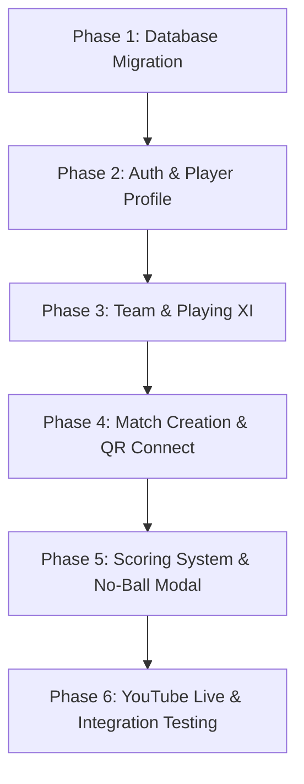

# 🏏 SB CricScore - புதிய அம்சங்களுக்கான முழுமையான மேம்பாட்டுத் திட்டம் (Development Plan)

> **File Location:** `DEVELOPMENT_PLAN.md`  
> **Last Updated:** 2026-09-29  
> **Status:** Ready for Implementation  

---

## 📌 உள்ளடக்க அட்டவணை (Table of Contents)
1. [அம்சங்களின் கண்ணோட்டம் (Features Overview)](#1-அம்சங்களின்-கண்ணோட்டம்-features-overview)
2. [தொடர்புடைய கோப்புகள் மற்றும் கோப்புறைகள் (Affected Files & Directories)](#2-தொடர்புடைய-கோப்புகள்-மற்றும்-கோப்புறைகள்-affected-files--directories)
3. [தரவுத்தள அட்டவணை மாற்றங்கள் (Database Schema & Migrations)](#3-தரவுத்தள-அட்டவணை-மாற்றங்கள்-database-schema--migrations)
4. [பகுதி 1: ப்ரொஃபைல் & யூசர் ரிஜிஸ்ட்ரேஷன் (Profile & User Registration)](#4-பகுதி-1-ப்ரொஃபைல்--யூசர்-ரிஜிஸ்ட்ரேஷன்-profile--user-registration)
5. [பகுதி 2: அணி மேலாண்மை (Team Management & Playing XI)](#5-பகுதி-2-அணி-மேலாண்மை-team-management--playing-xi)
6. [பகுதி 3: மேட்ச் உருவாக்கம் & QR/Link இணைப்பு (Match Creation & QR Flow)](#6-பகுதி-3-மேட்ச்-உருவாக்கம்--qrlink-இணைப்பு-match-creation--qr-flow)
7. [பகுதி 4: ஸ்கோரிங் முறை & No-Ball பாப்-அப் (Scoring & CricHeroes-Style No-Ball)](#7-பகுதி-4-ஸ்கோரிங்-முறை--no-ball-பாப்-அப்-scoring--cricheroes-style-no-ball)
8. [பகுதி 5: யூடியூப் லைவ் ஸ்ட்ரீமிங் (YouTube Live Integration)](#8-பகுதி-5-யூடியூப்-லைவ்-ஸ்ட்ரீமிங்-youtube-live-integration)
9. [படிநிலையான செயல்படுத்தல் திட்டம் (Step-by-Step Execution Phases)](#9-படிநிலையான-செயல்படுத்தல்-திட்டம்-step-by-step-execution-phases)

---

## 1. அம்சங்களின் கண்ணோட்டம் (Features Overview)

| No | அம்சம் (Feature) | விளக்கம் (Description) |
|---|---|---|
| **1** | **User Profile & Registration** | மொபைல் எண் + OTP லாகின், சுயவிவரப் பதிவு, போன் நம்பர் சர்ச், கேப்டன் மூலம் புதிய பிளேயர் சேர்க்கை. |
| **2** | **Team & Playing XI** | சொந்த அணி உருவாக்கம், 20 வீரர்கள் கொண்ட ஸ்குவாட், மேட்ச் தொடங்கும் முன் 11 வீரர்கள் (Playing XI) தேர்வு. |
| **3** | **Match Creation & QR Connect** | மைதானம், பந்து வகை, தேதி தேர்வு, QR Code / Match Link மூலம் எதிர் அணியை இணைத்தல். |
| **4** | **CricHeroes-Style Scoring** | No-Ball கிளிக் செய்தால் Bat Run, Bye, Leg-Bye, Boundary கேட்கும் Pop-up, சரியான Extras கணக்கீடு. |
| **5** | **YouTube Live Streaming** | கேப்டன்/அட்மின் YouTube Live URL இணைத்து ஆப்பில் ஒளிபரப்பும் வசதி, ஸ்பேம் தடுப்பு. |

---

## 2. தொடர்புடைய கோப்புகள் மற்றும் கோப்புறைகள் (Affected Files & Directories)

### 📂 Backend APIs (`/api/`)
- `api/otp_send.php` & `api/otp_verify.php` - OTP சரிபார்ப்பு மற்றும் லாகின்.
- `api/profile_update.php` & `api/player_profile_get.php` - பயனர் விவரங்கள்.
- `api/team_ops.php` & `api/team_add.php` - அணி மற்றும் 20 பிளேயர் ஸ்குவாட் மேலாண்மை.
- `api/match_create.php` - சிங்கிள் மேட்ச், QR கோட் ஜெனரேஷன், பந்து வகை, மைதான விவரங்கள்.
- `api/match_join_qr.php` - எதிர் அணி QR ஸ்கேன் அல்லது லிங்க் மூலம் போட்டியில் இணைதல்.
- `api/match_playing_xi.php` - Playing 11 (C, WK, Batting Order) தேர்வு செய்தல்.
- `api/ball_add.php` & `api/ball_undo.php` - No-Ball Pop-up Extras மற்றும் Free-hit துல்லியக் கணக்கீடு.
- `api/match_stream_update.php` - YouTube Live லிங்க் சேமிப்பு மற்றும் பார்வை அனுமதி.
- `init_db.php` / `update_db_v5.php` - புதிய அட்டவணைகள் மற்றும் காலம்கள் உருவாக்குதல்.

### 📱 Frontend / Mobile App (`/mobile_app/lib/` & `/pages/`)
- `mobile_app/lib/features/auth/` - OTP Login & Register UI.
- `mobile_app/lib/features/team/` - My Teams, Squad List (Max 20), Captain Add Player Dialog.
- `mobile_app/lib/features/match/match_create_screen.dart` - Match Details + QR Code Display.
- `mobile_app/lib/features/match/qr_scanner_screen.dart` - QR Code Scanner & Match Joining Screen.
- `mobile_app/lib/features/match/playing_xi_selector.dart` - 20-ல் 11 வீரர்களைத் தேர்வு செய்யும் திரை.
- `mobile_app/lib/features/match/scoring_screen.dart` - No-Ball Dialogue Modal (Runs / Extras / Dismissal).
- `mobile_app/lib/features/match/live_stream_player.dart` - YouTube Live Streaming Player Widget.
- `pages/match.php` & `pages/register_player.php` - வெப் பிரவுசர் பயனர்களுக்கான தொடர்புடைய பக்கங்கள்.

---

## 3. தரவுத்தள அட்டவணை மாற்றங்கள் (Database Schema & Migrations)

```sql
-- 1. Users / Players Table Enhancements
ALTER TABLE users ADD COLUMN phone VARCHAR(20) UNIQUE;
ALTER TABLE users ADD COLUMN role VARCHAR(50) DEFAULT 'All-rounder';
ALTER TABLE users ADD COLUMN batting_style VARCHAR(30) DEFAULT 'Right Hand Bat';
ALTER TABLE users ADD COLUMN bowling_style VARCHAR(30) DEFAULT 'Right-arm Medium';
ALTER TABLE users ADD COLUMN is_verified TINYINT(1) DEFAULT 0;

-- 2. Match Specific Enhancements
ALTER TABLE matches ADD COLUMN match_code VARCHAR(20) UNIQUE;
ALTER TABLE matches ADD COLUMN venue_name VARCHAR(150);
ALTER TABLE matches ADD COLUMN ball_type VARCHAR(30) DEFAULT 'tennis_light'; -- tennis_light, tennis_heavy, leather, rubber
ALTER TABLE matches ADD COLUMN match_date DATE;
ALTER TABLE matches ADD COLUMN invite_status VARCHAR(30) DEFAULT 'pending'; -- pending, accepted, started, completed
ALTER TABLE matches ADD COLUMN youtube_live_url VARCHAR(255);
ALTER TABLE matches ADD COLUMN is_stream_active TINYINT(1) DEFAULT 0;

-- 3. Match Playing XI Table
CREATE TABLE IF NOT EXISTS match_playing_xi (
    id INT AUTO_INCREMENT PRIMARY KEY,
    match_id INT NOT NULL,
    team_id INT NOT NULL,
    player_id INT NOT NULL,
    is_captain TINYINT(1) DEFAULT 0,
    is_wicketkeeper TINYINT(1) DEFAULT 0,
    batting_order INT DEFAULT 0,
    created_at TIMESTAMP DEFAULT CURRENT_TIMESTAMP,
    FOREIGN KEY (match_id) REFERENCES matches(id) ON DELETE CASCADE,
    FOREIGN KEY (team_id) REFERENCES teams(id) ON DELETE CASCADE
);

-- 4. Balls Table Free-hit and Extras flag
ALTER TABLE balls ADD COLUMN is_free_hit TINYINT(1) DEFAULT 0;
```

---

## 4. பகுதி 1: ப்ரொஃபைல் & யூசர் ரிஜிஸ்ட்ரேஷன் (Profile & User Registration)

### 🔹 பயனர் சுயவிவரப் பதிவு:
1. மொபைல் எண் உள்ளீடு ➔ OTP சரிபார்ப்பு (WhatsApp/SMS).
2. பெயர், ப்ரொஃபைல் படம், Batting Style, Bowling Style மற்றும் முதன்மை ரோல் (Batsman, Bowler, WK, All-Rounder) பதிவு செய்தல்.
3. பயனர் லாகின் செய்ததும் தனித்துவமான Player ID & Phone Number மூலம் தரவுத்தளத்தில் இணைக்கப்படும்.

### 🔹 கேப்டன் மூலம் பிளேயர் சேர்க்கை:
- ஆப் பயன்படுத்தத் தெரியாத கிராமப்புற/உள்ளூர் வீரர்களுக்கு:
  - கேப்டன் தனது அணியின் பக்கத்தில் **"Add New Player via Mobile"** தேர்வு செய்வார்.
  - வீரரின் பெயர், எண், ரோல் ஆகியவற்றை உள்ளிட்டதும் அந்த வீரரின் எண்ணிற்கு OTP செல்லும்.
  - கேப்டன் அந்த OTP-ஐ உள்ளிட்டு வீரரின் கணக்கை உறுதி செய்து நேரடியாகத் தனது அணியில் இணைப்பார்.

---

## 5. பகுதி 2: அணி மேலாண்மை (Team Management, Unlimited Squad & 11+3 Lineup)

### 🔹 சொந்த அணி உருவாக்கம் (My Own Team):
- பயனர் தனது விருப்பப்படி அணியின் பெயர் (எ.கா: FCC, Kings 11, Chennai Super Stars), லோகோ மற்றும் ஊரின் பெயரைப் பதிவு செய்யலாம்.
- அந்த அணிக்கு அவரே முதன்மை கேப்டனாக (Admin/Captain) இருப்பார்.

### 🔹 வரம்பற்ற வீரர்கள் பதிவு (Unlimited Squad Pool):
- ஒரு அணியில் எத்தனை வீரர்கள் வேண்டுமானாலும் (எ.கா: 50, 100, 200+ வீரர்கள் வரை - இந்தியா டீம் போல பெரிய ஸ்குவாட்) பதிவு செய்து வைத்திருக்கலாம். எந்தவித கட்டுப்பாடும்/வரம்பும் இல்லை.
- போன் நம்பர் மூலம் தேடி அல்லது கேப்டன் மூலமாக எளிதாக வீரர்களைச் சேர்க்கலாம்.

### 🔹 பிளேயிங் 11 + 3 சப்ஸ்டிடியூட் (Playing XI + Up to 3 Substitutes Selection):
- மேட்ச் தொடங்குவதற்கு முன் டாஸ் போடும் திரையில்:
  - அணியில் உள்ள அனைத்து வீரர்களின் பட்டியலும் தோன்றும்.
  - கேப்டன் **11 முதன்மை வீரர்களை (Playing XI)** தேர்வு செய்வார்.
  - கூடுதலாக **அதிகபட்சம் 3 சப்ஸ்டிடியூட் வீரர்களை (Substitutes 1, 2, 3)** தேர்வு செய்து கொள்ளலாம் (மொத்தம் 11+3 = 14 வீரர்கள் மேட்ச் லைன்-அப்பில் இருப்பார்கள்).
  - 11 பேருக்கு மேல் சேர்க்கப்படும் வீரர்கள் தானாகவே **`is_substitute = 1`** என பதியப்பட்டு மாற்று வீரர்களாக (Impact / Bench Substitutes) செயல்படுவர்.
  - கேப்டன் (C) மற்றும் விக்கெட் கீப்பரையும் (WK) உறுதி செய்யும் வசதி.

---

## 6. பகுதி 3: மேட்ச் உருவாக்கம் & QR/Link இணைப்பு (Match Creation & QR Flow)

### 🔹 போட்டி விவரங்கள் (Single Match Setup):
1. **Venue / Ground Name:** மைதானத்தின் பெயர் அல்லது ஊர் பெயர்.
2. **Ball Type:** Tennis (Light/Heavy), Rubber Ball, Leather Ball.
3. **Date & Overs:** போட்டி நடைபெறும் தேதி, ஓவர்கள் (எ.கா: 6, 8, 10, 20) மற்றும் விக்கெட்டுகள்.

### 🔹 QR Code & Match Link இணைப்பு முறை:
1. **Team A (Host Team):** போட்டியை உருவாக்கியதும் திரையில் ஒரு **QR Code** மற்றும் **Match Code** (எ.கா: `SB-8921`) உருவாக்கப்படும்.
2. **Team B (Opponent Team - நேரில் சந்திக்கும் போது):**
   - ஆப்பில் **"📷 Scan Match QR"** திறந்து Team A காட்டும் QR கோடை ஸ்கேன் செய்வர்.
   - ஸ்கேன் செய்தவுடன் Team B-ன் அணி விவரங்கள் மற்றும் Playing 11 தானாக அந்தப் போட்டியில் இணையும்.
3. **முன்கூட்டியே மேட்ச் ஃபிக்ஸ் செய்ய (WhatsApp / Message Link):**
   - **"📲 Share Match Link"** பட்டன் மூலம் WhatsApp-ல் லிங்க் பகிரப்படும் (`https://sbastro.com/tournament/join.php?code=SB-8921`).
   - எதிர் அணி கேப்டன் லிங்கை கிளிக் செய்து போட்டியை உறுதி செய்து தங்களது அணியை இணைத்துக் கொள்ளலாம்.

---

## 7. பகுதி 4: ஸ்கோரிங் முறை & No-Ball பாப்-அப் (Scoring & CricHeroes-Style No-Ball)

### 🔹 CricHeroes பாணி No-Ball Pop-Up Flow:
ஸ்கோரர் **[ NB ]** பட்டனை அழுத்தியவுடன் கீழ்வரும் தேர்வுகளுடன் கூடிய பாப்-அப் திரை தோன்றும்:

```text
┌──────────────────────────────────────────────┐
│           ⚠️ NO BALL OCCURRED                │
├──────────────────────────────────────────────┤
│ 1. Runs from Bat:                            │
│    [ 0 ] [ 1 ] [ 2 ] [ 3 ] [ 4 (Four) ] [ 6 ]│
│                                              │
│ 2. Extras (Non-bat):                         │
│    [ +1 Extra (Default) ]                    │
│    [ Bye Runs ]  [ Leg-Bye Runs ]            │
│                                              │
│ 3. Wicket / Run-out:                         │
│    [ Run Out Striker ] [ Run Out Non-Striker]│
└──────────────────────────────────────────────┘
```

### 🔹 கணக்கீட்டு விதிகள்:
- **No-Ball + Bat Run:** மட்டையில் அடித்த ரன்கள் பேட்ஸ்மேனின் கணக்கில் சேரும்; +1 எக்ஸ்ட்ரா ரன் அணியின் மொத்த ஸ்கோரில் சேரும்; பௌலர் கணக்கில் ரன் சேரும்; ஆனால் Legal Ball Count கூடாது.
- **Free Hit:** அடுத்த பந்துக்கு தானாகவே `FREE HIT` என திரையில் காட்டப்படும்.
- **Wides / Byes / Leg-Byes:** அனைத்து எக்ஸ்ட்ராக்களும் முறையே பேட்ஸ்மேன்/பௌலர்/அணியின் கணக்கில் துல்லியமாக வரவு வைக்கப்படும்.

---

## 8. பகுதி 5: யூடியூப் லைவ் ஸ்ட்ரீமிங் (YouTube Live Integration)

### 🔹 நேரலை இணைப்பு (Live Stream Setup):
- ஸ்கோரர் அல்லது அட்மின் மேட்ச் செட்டிங்ஸில் **"🔴 YouTube Live URL"** பாக்ஸில் தங்களது யூடியூப் வீடியோ லிங்கை பேஸ்ட் செய்யலாம் (எ.கா: `https://youtu.be/xxxxxx`).
- "Go Live" கொடுத்ததும் மேட்ச் ஸ்டேட்டஸில் `LIVE STREAMING 🔴` பேட்ஜ் ஒளிரும்.

### 🔹 பார்வையாளர் பார்வை (Spectator View):
- பார்வையாளர்கள் ஆப்பில் போட்டியைத் திறக்கும்போது மேல் பகுதியில் யூடியூப் லைவ் பிளேயர் திரையிடப்படும்.
- வீடியோவின் கீழ் நிகழ்நேர பந்து வீச்சு (Live Ball-by-Ball Commentary) மற்றும் ஸ்கோர்கார்டு உடனுக்குடன் புதுப்பிக்கப்படும்.

### 🔹 ஸ்பேம் கட்டுப்பாடு & கட்டண முறை (Spam Prevention / Verification):
- தவறான அல்லது ஆபாசமான லிங்க்களைத் தவிர்க்க:
  - வெரிஃபைடு கேப்டன்கள் / அட்மின்களுக்கு மட்டுமே நேரடி அனுமதி.
  - அல்லது விருப்பத்தேர்வாக சிறிய கட்டணம் (எ.கா: ₹100 via UPI / Razorpay) செலுத்திய பின் ஸ்ட்ரீமிங் லிங்க் செயல்படுத்தப்படும் வசதி.

---

## 9. படிநிலையான செயல்படுத்தல் திட்டம் (Step-by-Step Execution Phases)



### 📅 Phase 1: Database Migration & Model Updates
- `init_db.php` மற்றும் `update_db_v5.php` எழுதி புதிய ஃபீல்டுகள் மற்றும் அட்டவணைகளை உருவாக்குதல்.

### 📅 Phase 2: User Profile & Registration Flow
- `api/otp_send.php`, `api/otp_verify.php`, `api/captain_register_player.php` உருவாக்குதல்.
- மொபைல் ஆப்பில் ப்ரொஃபைல் & சர்ச் ஸ்கிரீன் இணைத்தல்.

### 📅 Phase 3: Team Management & Playing XI
- `api/team_ops.php` மூலம் 20 வீரர்கள் ஸ்குவாட் அமைத்தல்.
- மேட்ச் தொடங்கும் முன் Playing XI செலக்டர் ஸ்கிரீன் உருவாக்குதல்.

### 📅 Phase 4: Single Match Creation & QR Connect
- `api/match_create.php` (Ground, Ball Type, Date, Match Code).
- QR Generator & Mobile QR Scanner (`mobile_app/lib/features/match/qr_scanner_screen.dart`).

### 📅 Phase 5: CricHeroes-Style Scoring & No-Ball Pop-Up
- `api/ball_add.php` பேக்-எண்ட் மேம்பாடு.
- ஸ்கோரிங் திரையில் No-Ball Pop-up Dialog & Free-Hit Banner சேர்த்தல்.

### 📅 Phase 6: YouTube Live Integration & End-to-End Testing
- YouTube Player Embed விட்ஜெட் சேர்த்தல் & Live Stream URL API உருவாக்குதல்.
- முழுமையான மேட்ச் ஃப்ளோ டெஸ்டிங்.
